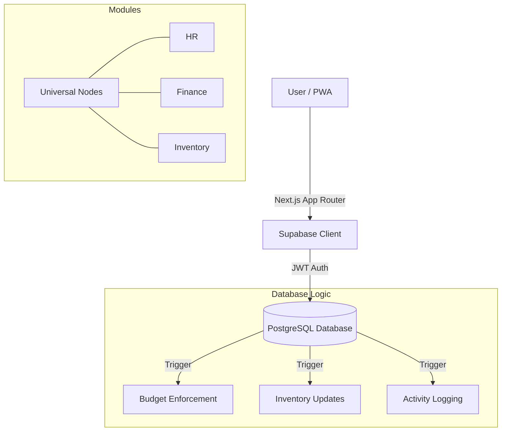

# OSPREY System Architecture

## 1. System Overview
OSPREY is a Universal Internal Operations Operating System designed for high-complexity organizations (Universities, Governments, Large Enterprises). It abandons the traditional module-silo approach in favor of a **Universal Node Architecture**.

## 2. Universal Node Architecture
Instead of hardcoding "Departments" or "Branches", OSPREY treats every organizational entity as a `Node`.
*   **Nodes:** The core atoms. A Node can be a Site, a Team, a Project, or a Cost Center.
*   **Node Types:** Definitions that give Nodes behavior (e.g., "Store" type implies it can hold Inventory).
*   **Hierarchy:** Infinite recursive parent-child relationships.
*   **Polymorphism:** Modules (Finance, HR) attach data to Nodes, not static tables.

## 3. Tech Stack
*   **Frontend:** Next.js 14 (App Router), Tailwind CSS, Lucide Icons.
*   **Backend:** Supabase (PostgreSQL 15+).
*   **Logic Layer:** PL/pgSQL Functions & Triggers (Database-centric logic for ACID compliance).
*   **Auth:** Supabase Auth (JWT).
*   **PWA:** Service Workers for offline capability.

## 4. Security Model
OSPREY uses a **Zero-Trust, Row-Level Security (RLS)** model.
*   **Multi-tenancy:** Enforced via `organization_id` on EVERY table.
*   **RLS Policies:** Database triggers prevent cross-tenant data access.
*   **RBAC:** Role-Based Access Control is data-driven (`roles`, `permissions` tables), not hardcoded in code.

## 5. Automation Engine
*   **Triggers:** Database triggers handle critical events (e.g., Budget Checking on PO Approval).
*   **Audit Trail:** A central `activity_log` captures every Write action automatically.
*   **Notification:** Alerts are generated asynchronously via DB triggers.

## 6. Diagram Description (Conceptual)

